# **_Movie Ratings_**

Movie Ratings is an application that gets the viewers opinion and rates movies. Users are able view the current listings and their ratings. The user can enter their own rating from 1 to 10 in accordance with the current listed movies. They can search for the highest and lowest rated movies listed. This application targets users with an interest in sharing their opinion.

# Table of Contents

* [**Project**](<#project>)
    * [Site User Goals](<#site-user-goals>)
    * [Site Owners Goal](<#site-owner-goals>)

* [**User Experience(UX)**](<#user-experience>)
    * [Site Structure](<#site-structure>)
    * [Flow Chart](<#flow-chart>)
    * [Data Model](<#data-model>)

* [**Features**](<#features>)

* [**Features Left to Implement**](<#features-left-to-implement>)
    
* [**Technologies Used**](<#technologies-used>)
    * [Languages](<#languages>)
    * [Frameworks, Libraries & Software](<#frameworks,-libraries-&-software>)
    * [Python Packages](<#python-packages>)

* [**Testing**](<#testing>)
    * [Code Validation](<#code-validation>)
    * [Known Bugs](<#known-bugs>)
    * [Unfixed Bugs](<#unfixed-bugs>)

* [**Deployment**](<#deployment>)

* [**Credits**](<#credits>)
    * [Content](<#content>)

* [**Acknowledgements**](<#acknowledgements>)

# Site User Goals
Movie Ratings application aims to provied information of our current movie listings and allow the user to input their own rating and join the community in sharing their 
opinion on their faviort movies.

# Site Owners Goal
The goal of the site is to provide an application where the user can add their opinion to the current ratings list and add their choice of movie if not already on the list.

# User Experience (UX)

# Site Structure
Movie Rating's is a terminal based application that is being presented in a single page website. When the application starts the user is welcomed and presented with a list of options to either view the current ratings, adding their own rating and movie title and viewing the highest rated and lowest rated movies. You can read more about the choices in the [Features](<#Features>).

# Flow Chart
The flow chart for this application was made with the online service Lucid App. This chart gives you an overview of the application.

<b>Flow Chart</b>

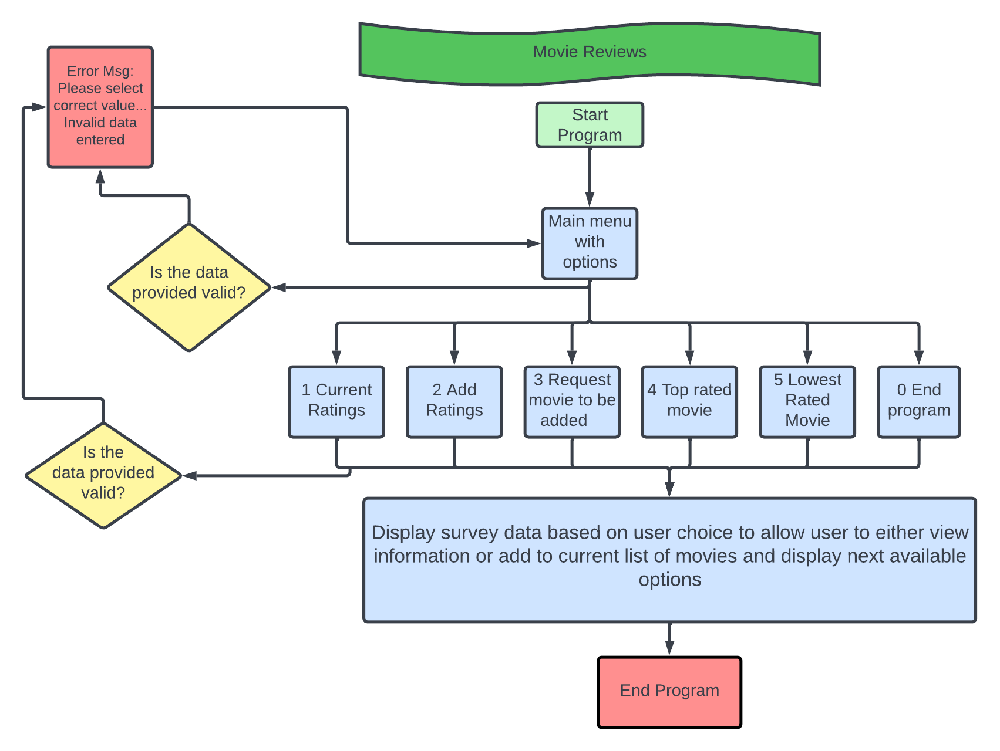

 

# Data Model
To store all the data from the application I choice to use [Google Sheets](https://www.google.co.uk/sheets/about/). All data is being transfered between the application and the google sheet.

* **Name of workbook** - movie_reviews
* **Name of worksheets** - 
    * inputs
    * requests
    * current
    * listings
    * highest
    * lowest

The workbook contains 6 spreadsheets meet user inputs and request needs for the functions.

# Features
When the application starts it calls the main function which presents a menu of options for the user to select. Each on of these options relate to a different function to help the user navigate the application. The list consists of 6 options that allows the user to either view the information in different ways or add their ratings to the current list and request their movie title to be added to the list.

# Existing Features

## Main menu
The main menu consists of 6 options which the user can choose from. See list of choices explained below.

<b>Main Menu</b>

 

## Current Ratings
When the user selects option 1 they are provided with a list of movie titles and their current ratings from our application. The user is then present with some options to either add to the current ratings, request their own movie title to be added to the list, head back to the main menu or end application.

<b>Current Ratings</b>

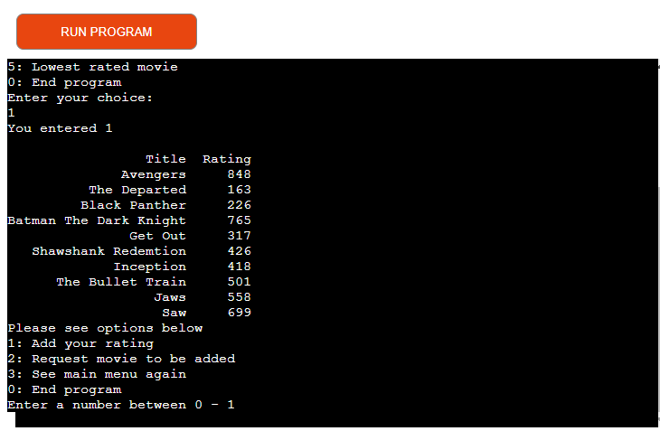

 

## Add Rating to list
When the user selects option 2 they are shown the current movie listings and asked to input a rating from 1 to 10 for each movie listed with their input seperated by a comma ','

<b>Option 2</b>

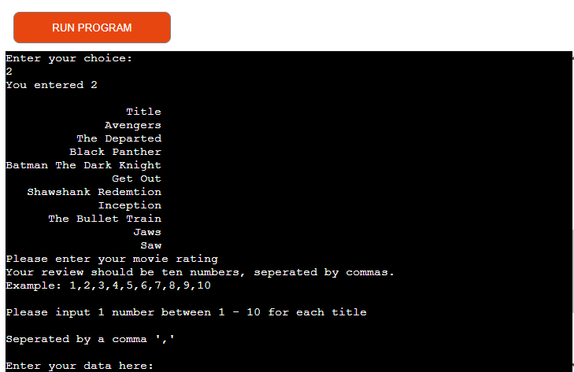

 

After the user has entered their ratings their rating is then updated in the inputs google sheet.

They are then shown a list of options to either to add another rating, see the main menu or end the application.

<b>Option 2 Options</b>

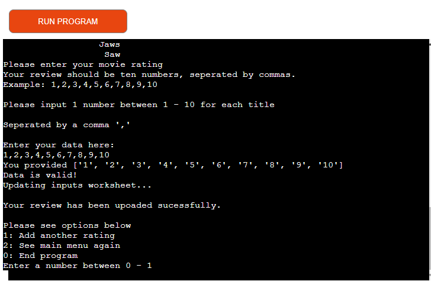

 

## Request a movie to be added to the list
Option 3 allows the user to request a movie title to be added to the list. Currently the user inputs their title and is informed their input will be reviewed and added to the list. This feature currently does not add the users input to the google sheet, please see [Existing-bugs](<#existing-bugs>).

## Top Rated Movie
Option 4 allows the user to view the highest rated movie in the current list and is given options to either see the lowest rated movie, add their rating to the current list, see main menu or end the program.

<b>Option 4</b>

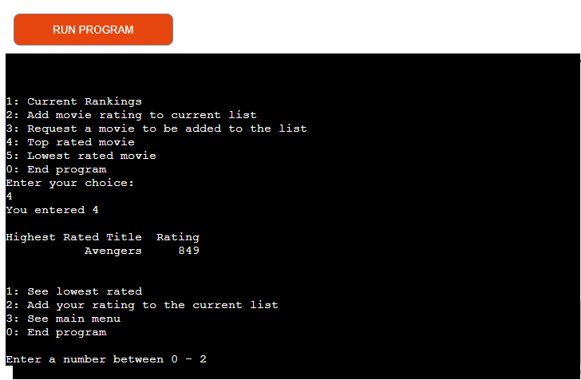

 

## Lowest Rated Movie
Option 5 allows the user to view the lowest rated movie in the current list and is given options to either see the highest rated movie, add their rating to the current list, see the main menu or end the program.

<b>Option 5</b>

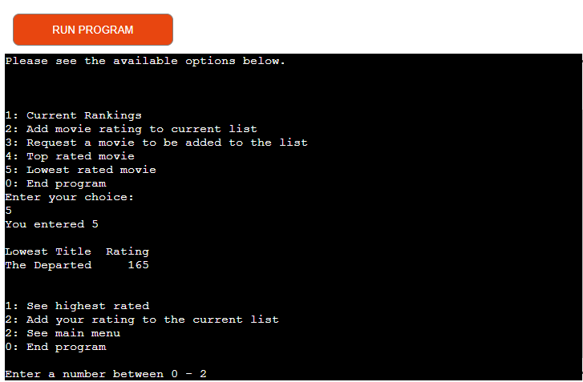

 

## End Program
This options ends the program.

<b>Option 0</b>

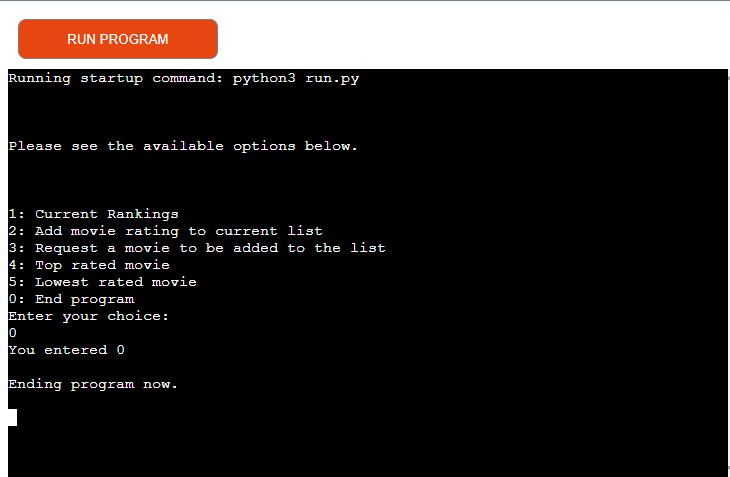

 

# Features Left to Implement

## Add Comments
* This option allows the user to add a comment with their rating allowing the user to express their rating into words.

## Remove User Inputs
* This would allow the user to remove already inputed data. Incase the user made a typo.

## Search Movie Titles
* This would allow the user to search our list and see if that movie is in the list and allow them to enter a comment and/or a rating.

# Technologies Used

## Languages

* [Python](https://en.wikipedia.org/wiki/Python_(programming_language)) - Provides the functionality for the application.

## Frameworks, Libraries & Software

* [Google Sheets](https://www.google.co.uk/sheets/about/) - Used to host the application data.
* [Github](https://github.com/) - Used to host and edit the website.
* [Heroku](https://en.wikipedia.org/wiki/Heroku) - A cloud platform that the application is deployed to.

## Python Packages
* [GSpread](https://pypi.org/project/gspread/) - A Python API for Google Sheets that makes it possible to transfer data between the application and the Google Sheet.
* [pandas](https://www.w3schools.com/python/pandas/pandas_intro.asp) - Pandas is a Python library used for working with data sets. It has functions for analyzing, cleaning, exploring, and manipulating data.

# Testing

## Code Validation
The Movie Rating application has been tested through [Code Institute Validator](https://pep8ci.herokuapp.com/)

<b>Python Linter</b>

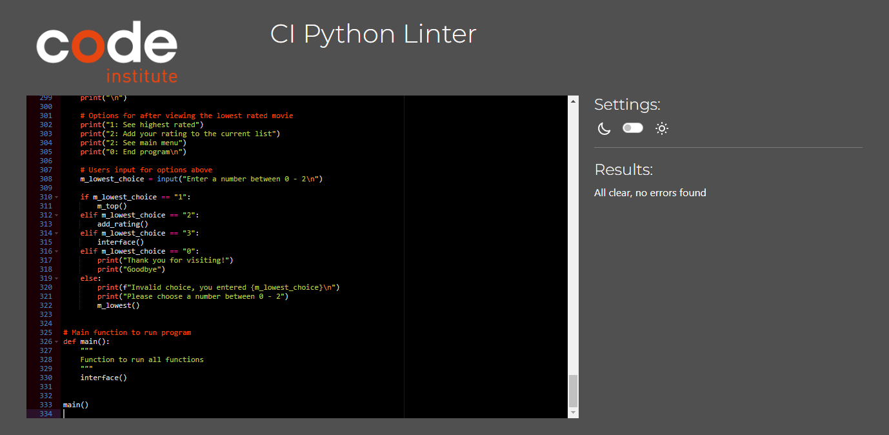

 

## Known Bugs

<b>Highest rated display with no index</b>

 

<b>User Rating Bug 1</b>

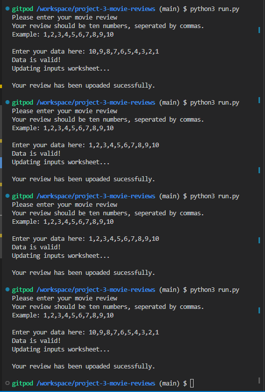

 

<b>User Rating Bug 1 spreadsheet</b>

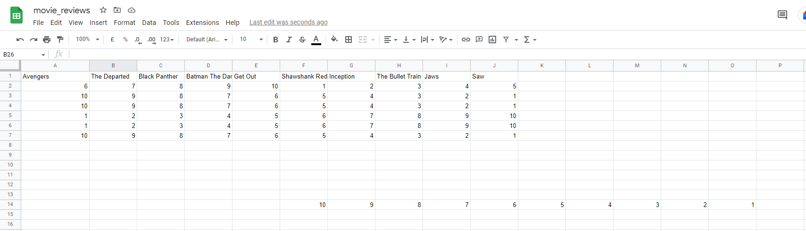

 

## Unfixed Bugs
By the end I was unable to enable the feature to allow the user to input their titles to be added to the list. I hope to have this working for the next update.

<b>add-title-bug</b>

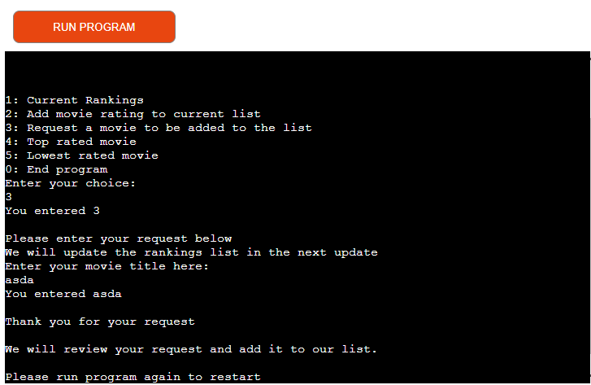

 

# Deployment

## Deployment To Heroku

The project was deployed to [Heroku](https://www.heroku.com). To deploy, please follow the process below:

1. The first step is to log in to Heroku (or create an account if needed).

<b>Step 1</b>

 

2. In the top right corner there is a button that is labeled 'New'. Click that and then select 'Create new app'.

<b>Step 2</b>

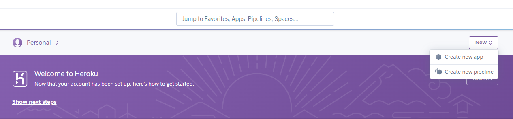

 

3. Then you need to enter an application name that needs is unique. When you have chosen the name, choose your region and click 'Create app".

4. On the next page, click the 'Settings' tab and find the "Config Vars" section. When you have found it, click "Reveal Config Vars". Now it's time to add values. In the 'movie reviews' case I needed to add two values. The first one was the credentials (KEY input field = "CREDS", VALUE input field = "your credentials", click the 'Add' button. Next I had to add another key, enter "PORT" in the KEY input field and "8000" in the VALUE field, click the 'Add' button.

5. Next step is to add buildpacks to the application which will run when the application is deployed. The reason why this is needed is because all dependencies and configurations will be installed for the application. To do this you scroll down to the buildpacks section on the settings page and click the button 'Add buildpack'.

6. Add "Python" and "node.js". It is important that Python is listed above node.js. If it's not you can sort it by dragging and dropping.

7. Now it's time for deployment. Scroll to the top of the settings page and click the 'Deploy' tab. For deployment method, select 'Github'. Search for the repository name you want to deploy and then click connect.

8. Scroll down on the deploy page and choose deployment type. Choose to enable automatic deployments if you want to and then  click 'Deploy Branch'.

The live link to the 'Movie Ratings' Github repository can be found [here](https://github.com/S-shah93/project-3-movie-reviews).

## How To Fork The Repository On GitHub

To fork the repository, take these steps:

1. After logging in to GitHub, locate the repository. On the top right side of the page there is a 'Fork' button. Click on the button to create a copy of the original repository.

<b>Github Fork</b>

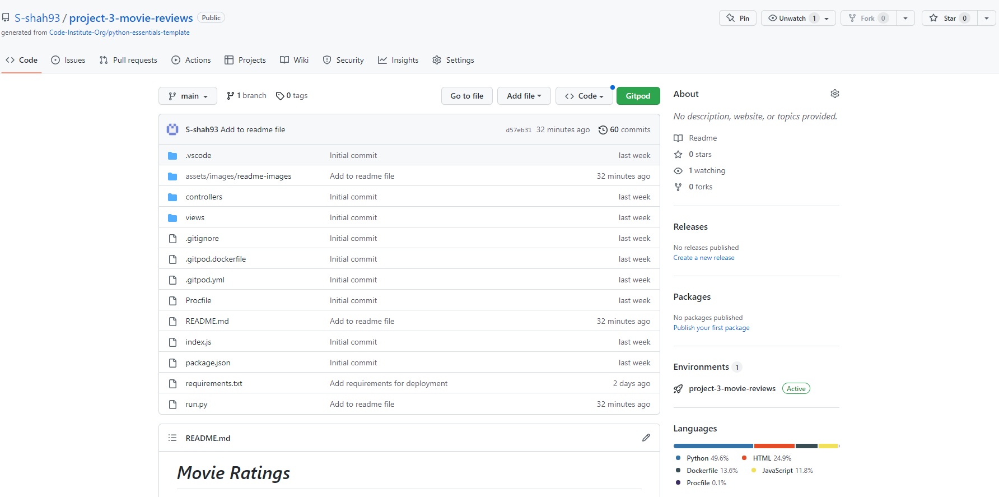

 

# Credits

## Content

These three projects helped me decide on the type of application I wanted to build, seeing how their applications worked in the terminal gave me ideas for my own. 
* Inspiration taken from [Joao4569](https://github.com/Joao4569/survey-data-capture-and-analyse) and [Jca-Dev](https://github.com/Jca-Dev/Project_3_Python)

* Template for read.me was inspired by [worldofmarcus](https://github.com/worldofmarcus/project-portfolio-3#additional-testing)

* All text content written by Sumair Shah.

* In addition, many blogs from W3Schools, blogs online on what function to use and Youtube videos were researched in regards to the python functions.

* Code Institutes videos on how to deploy the project were beneficial.

# Acknowledgements
The application 'movie ratings' was completed as the Portfolio Project #3 (*Python*) for the Full Stack Software Development Diploma at the [Code Institute](https://codeinstitute.net/). I would like to thank my mentor [Precious Ijege](https://www.linkedin.com/in/precious-ijege-908a00168/) for relevant feedback during the project.