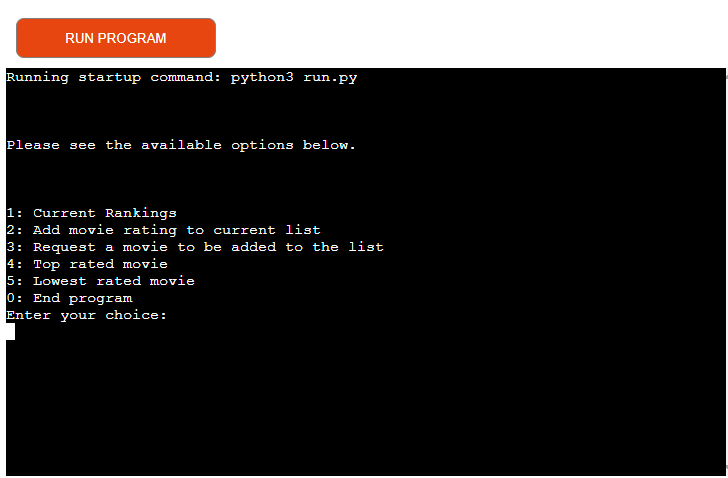

# **_Movie Ratings_**

Movie Ratings is an application that gets the viewers opinion and rates movies. Users are able view the current listings and their ratings. The user can enter their own rating from 1 to 10 in accordance with the current listed movies. They can search for the highest and lowest rated movies listed. This application targets users with an interest in sharing their opinion.

# Table of Contents

* [**Project**](<#project-overview>)
    * [Site User Goals](<#site-user-goals>)
    * [Site Owners Goal](<#site-owner-goals>)

* [**User Experience(UX)**](<#project-overview>)
    * [Site Structure](<#site-structure>)
    * [Flow Chart](<#flow-chart>)
    * [Data Model](<#data-model>)

* [**Features**](<#project-overview>)
    * [Site Structure](<#site-structure>)
    * [Flow Chart](<#Flow Chart>)

* [**Features Left to Implement**](<#features-left-to-implement>)
    * [Site Structure](<#site-structure>)
    * [Flow Chart](<#Flow Chart>)

    
* [**Technologies Used**](<#project-overview>)
    * [Site Structure](<#site-structure>)
    * [Flow Chart](<#Flow Chart>)

* [**Testing**](<#project-overview>)
    * [Site Structure](<#site-structure>)
    * [Flow Chart](<#Flow Chart>)

    
* [**Deployment**](<#project-overview>)

* [**Credits**](<#project-overview>)

* [**Acknowledgements**](<#project-overview>)

# Site User Goals
Movie Ratings application aims to provied information of our current movie listings and allow the user to input their own rating and join the community in sharing their 
opinion on their faviort movies.

# Site Owners Goal
The goal of the site is to provide an application where the user can add their opinion to the current ratings list and add their choice of movie if not already on the list.

# User Experience (UX)

# Site Structure
Movie Rating's is a terminal based application that is being presented in a single page website. When the application starts the user is welcomed and presented with a list of options to either view the current ratings, adding their own rating and movie title and viewing the highest rated and lowest rated movies. You can read more about the choices in the [Features](<#Features>).

# Data Model
To store all the data from the application I choice to use [Google Sheets](https://www.google.co.uk/sheets/about/). All data is being transfered between the application and the google sheet.

* **Name of workbook** - movie_reviews
* **Name of worksheets** - 
    * inputs
    * requests
    * current
    * listings
    * highest
    * lowest

The workbook contains 6 spreadsheets meet user inputs and request needs for the functions.

# Features
When the application starts it calls the main function which presents a menu of options for the user to select. Each on of these options relate to a different function to help the user navigate the application. The list consists of 6 options that allows the user to either view the information in different ways or add their ratings to the current list and request their movie title to be added to the list.

# Existing Features

## Main menu
The main menu consists of 6 options which the user can choose from. See list of choices explained below.

<b>Main Menu</b>

 

## Current Ratings
When the user selects option 1 they are provided with a list of movie titles and their current ratings from our application. The user is then present with some options to either add to the current ratings, request their own movie title to be added to the list, head back to the main menu or end application.

<b>Current Ratings</b>

 

## Add Rating to list
When the user selects option 2 they are shown the current movie listings and asked to input a rating from 1 to 10 for each movie listed with their input seperated by a comma ','

<b>Option 2</b>

 

After the user has entered their ratings their rating is then updated in the inputs google sheet.

They are then shown a list of options to either to add another rating, see the main menu or end the application.

<b>Option 2 Options</b>

 

## Request a movie to be added to the list
Option 3 allows the user to request a movie title to be added to the list. Currently the user inputs their title and is informed their input will be reviewed and added to the list. This feature currently does not add the users input to the google sheet, please see [Existing-bugs](<#existing-bugs>).

## Top Rated Movie
Option 4 allows the user to view the highest rated movie in the current list and is given options to either see the lowest rated movie, add their rating to the current list, see main menu or end the program.

<b>Option 4</b>

 

## Lowest Rated Movie
Option 5 allows the user to view the lowest rated movie in the current list and is given options to either see the highest rated movie, add their rating to the current list, see the main menu or end the program.

<b>Option 5</b>

 

## End Program
This options ends the program.

<b>Option 0</b>

 

# Features Left to Implement

## Add Comments
* This option allows the user to add a comment with their rating allowing the user to express their rating into words.

## Remove User Inputs
* This would allow the user to remove already inputed data. Incase the user made a typo.

## Search Movie Titles
* This would allow the user to search our list and see if that movie is in the list and allow them to enter a comment and/or a rating.

# Technologies Used

## Languages

* [Python](https://en.wikipedia.org/wiki/Python_(programming_language)) - Provides the functionality for the application.

## Frameworks, Libraries & Software

* [Google Sheets](https://www.google.co.uk/sheets/about/) - Used to host the application data.
* [Github](https://github.com/) - Used to host and edit the website.
* [Heroku](https://en.wikipedia.org/wiki/Heroku) - A cloud platform that the application is deployed to.

## Python Packages
* [GSpread](https://pypi.org/project/gspread/) - A Python API for Google Sheets that makes it possible to transfer data between the application and the Google Sheet.
* [pandas](https://www.w3schools.com/python/pandas/pandas_intro.asp) - Pandas is a Python library used for working with data sets. It has functions for analyzing, cleaning, exploring, and manipulating data.

# Testing

## Code Validation
The Movie Rating application has been tested through [Code Institute Validator](https://pep8ci.herokuapp.com/)

<b>Python Linter</b>

 

